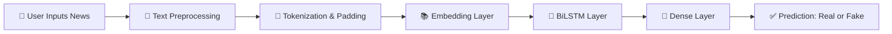

<h1 align='center'>📰 US Fake News Detection System using BiLSTM</h1>

<p align="center">
  
  
  
  
</p>

<p align="center">
  <b>Deep Learning based NLP system to detect Fake News related to the United States 🇺🇸</b>
</p>


---

## 🌐 Live Application

🚀 The Fake News Detection System is deployed and accessible online.

🔗 **Live App Link:**  
👉 (https://fakenews-nbenckct3ukauqlhmfuejx.streamlit.app/)

---


## 📌 Project Overview

The **US Fake News Detection System** is a Deep Learning-based Natural Language Processing (NLP) application designed to classify U.S. news articles as:

- ✅ **Real News**
- ❌ **Fake News**

The system uses a **Bidirectional Long Short-Term Memory (BiLSTM)** neural network for text classification and is deployed using **Streamlit** to provide a clean and interactive web interface for real-time predictions.

---

## 🎯 Problem Statement

With the exponential growth of digital media, misinformation spreads faster than ever. Fake news can:

- Mislead the public  
- Influence political opinions  
- Create social unrest  
- Damage credibility of authentic journalism  

### 🚀 Objective

This project aims to:

- Detect fake news related to U.S. articles  
- Reduce misinformation spread  
- Demonstrate Deep Learning in NLP  
- Provide a real-time, user-friendly prediction interface  

---

## 🧠 Model Architecture

### 🔹 Deep Learning Pipeline
```
Input News Text
        ↓
Text Cleaning & Preprocessing
        ↓
Tokenization
        ↓
Padding Sequences
        ↓
Embedding Layer
        ↓
Bidirectional LSTM (BiLSTM)
        ↓
Dense Layer
        ↓
Sigmoid Activation
        ↓
Prediction (Real / Fake)
```

---

## 📊 Model Workflow Diagram



---

## 🛠️ Tech Stack

| 🔧 Technology | 📌 Purpose |
|--------------|------------|
| **Python** | Programming Language |
| **TensorFlow / Keras** | Deep Learning Framework |
| **BiLSTM** | Text Classification Model |
| **Streamlit** | Web Application Deployment |
| **Pandas** | Data Processing |
| **NumPy** | Numerical Computation |
| **Scikit-learn** | Model Evaluation |

---

## 📂 Project Structure

```
Fake-News-Detection/
│
├── app.py                  # Streamlit Application
├── model.h5                # Trained BiLSTM Model
├── tokenizer.pkl           # Saved Tokenizer
├── dataset.csv             # USA News Dataset
├── requirements.txt        # Dependencies
└── README.md               # Project Documentation
```

---

## 🚀 How to Run Locally

```bash
# Clone the repository
git clone https://github.com/your-username/your-repo-name.git

# Navigate into project directory
cd your-repo-name

# Install dependencies
pip install -r requirements.txt

# Run the Streamlit app
streamlit run app.py
```

---

## ✨ Key Features

✔️ Real-time news classification  
✔️ Deep Learning powered NLP model  
✔️ Clean & interactive Streamlit UI  
✔️ USA-focused dataset  
✔️ Lightweight deployment  
✔️ Modular project structure  

---

## 📈 Future Improvements

🔮 Add prediction confidence score visualization  
🌍 Increase dataset size and diversity  
📰 Integrate Live News API  
🤖 Upgrade to Transformer models (BERT / RoBERTa)  
☁️ Deploy on AWS / GCP / Azure  
📊 Add performance metrics dashboard  

---

## 📊 Model Performance (Optional Section)

You can include:

- Accuracy  
- Precision  
- Recall  
- F1-Score  
- Confusion Matrix  

*(Add results after training your final model)*

---

## ⚠️ Disclaimer

This project is developed for **educational and research purposes only**.

Predictions are generated based on trained data and may not always be 100% accurate. The system should not be used as the sole source for verifying news authenticity.

---

## 👨‍💻 Author

**Akshad Joshi**  
PVG COET  

---

⭐ If you found this project helpful, consider giving it a star!
